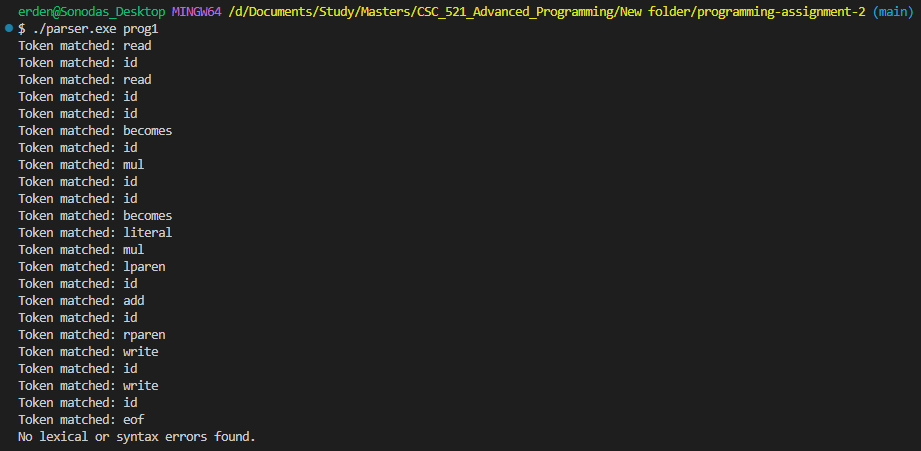
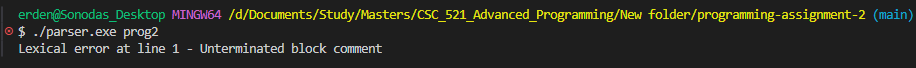
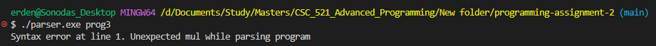
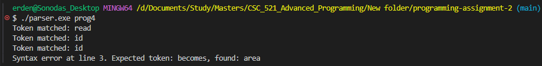
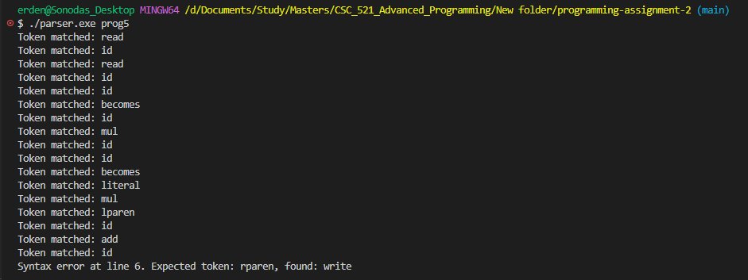

# Table-Driven LL(1) Parser for the Calculator Language

This folder contains two C programs, called "parser.c" and "scanner.c", that implement a table-driven LL(1) parser for the calculator language.

## Compilation and Execution

To compile the C program, navigate to the project directory and run:

```bash
gcc parser.c scanner.c -o parser
```

To run the program, navigate to the project directory and run:

```bash
.\parser <inputFile>
```

The command-line argument is the input file.

### Output

The program will print the following information:

- The tokens matched
- Lexical errors if any (including the line number and the unexpected token)
- Syntax errors if any (including the line number, the expected token and the found token)

### Screenshots

The following screenshots show the successful execution of the programs:







### Contributors

Erdenetulga Bilegdemberel
Jonny Eduardo Banach
